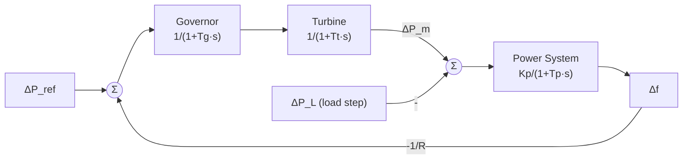

# Two-Area Load Frequency Control (LFC) System

MATLAB/Simulink implementation of Load Frequency Control, built in stages: a **validated single-area baseline** first, then extension to an **interconnected two-area system** with tie-line dynamics and secondary PI control via Area Control Error (ACE).


---

## Table of Contents
1. [Overview](#overview)
2. [Project Status & Roadmap](#project-status--roadmap)
3. [Background: What is LFC?](#background-what-is-lfc)
4. [Single-Area Model](#single-area-model)
5. [Debugging Case Study: The -3.57 Hz Anomaly](#debugging-case-study-the--357-hz-anomaly)
6. [Results](#results)
7. [Two-Area Extension (Planned)](#two-area-extension-planned)
8. [Repository Structure](#repository-structure)
9. [How to Run](#how-to-run)
10. [Key Learnings](#key-learnings)
11. [References](#references)

---

## Overview

In an interconnected power system, any mismatch between generation and load shows up as a deviation in system frequency. **Load Frequency Control (LFC)** keeps frequency at its nominal value and, in multi-area systems, keeps scheduled tie-line power exchanges.

This project is a hands-on deep dive into power system dynamics. Before building the interconnected model, I built and rigorously verified a standalone **single-area model** against analytical (Final Value Theorem) calculations.

**Highlights**
- Single-area LFC model with governor, turbine, and load-frequency (power system) blocks
- Root-cause debugging of a ~150x steady-state error, resolved to match theory exactly
- Analytical vs. simulation cross-validation (steady-state deviation of **-0.0235 Hz**)
- Roadmap to a two-area model with tie-line flow and PI-based secondary control

---

## Project Status & Roadmap

| Stage | Description | Status |
|-------|-------------|--------|
| 1 | Single-area model (primary control / droop) | Done |
| 2 | Debug and validate against Final Value Theorem | Done |
| 3 | Add second control area and tie-line network | Planned |
| 4 | Model tie-line power flow deviation (ΔP_tie) | Planned |
| 5 | Secondary PI controller with ACE loop | Planned |
| 6 | Compare primary-only vs. PI-augmented response | Planned |

*Part of a 10-day learning roadmap.*

---

## Background: What is LFC?

### Control layers
- **Primary control (governor droop):** fast, local; arrests frequency drop but leaves a steady-state offset.
- **Secondary control (AGC/LFC):** slower; integral action removes the offset and restores tie-line schedules.
- **Tertiary control:** economic dispatch (out of scope here).

### Component models (first-order approximations)

| Component | Transfer Function |
|-----------|-------------------|
| Governor | `G_g(s) = 1 / (1 + T_g s)` |
| Turbine | `G_t(s) = 1 / (1 + T_t s)` |
| Power system (load + rotating mass) | `G_p(s) = K_p / (1 + T_p s)` where `K_p = 1/D`, `T_p = 2H/(f·D)` |
| Speed regulation (droop) | `1/R` |

### Steady-state frequency deviation (single area, primary control only)

By the Final Value Theorem, for a step load change ΔP_L:

```
Δf_ss = - ΔP_L / (1/R + D)
```

where `R` is the droop (regulation) constant and `D` is the load-damping coefficient. This is the analytical benchmark the simulation is checked against.

---

## Single-Area Model



### Simulink Implementation

<p align="center">
  
</p>
<p align="center"><em>Figure 1: Simulink block diagram of the single-area LFC model.</em></p>

**Important structural point:** the load disturbance ΔP_L enters at the **generator/load junction** (the summing point ahead of the power system block), as an uncompensated power mismatch (ΔP_m − ΔP_L). It does *not* enter through the governor's input path.

### Parameters

> Fill in with the values used in your model.

| Parameter | Symbol | Value | Unit |
|-----------|--------|-------|------|
| Governor time constant | T_g | _TBD_ | s |
| Turbine time constant | T_t | _TBD_ | s |
| Power system gain | K_p | _TBD_ | Hz/pu MW |
| Power system time constant | T_p | _TBD_ | s |
| Speed regulation | R | _TBD_ | Hz/pu MW |
| Load step | ΔP_L | _TBD_ | pu MW |

---

## Debugging Case Study: The -3.57 Hz Anomaly

### Symptom
The model was stable and closed-loop, yet frequency settled at **-3.57 Hz** versus the theoretical **-0.0235 Hz**, a discrepancy of roughly **150x** (3.57 / 0.0235 ≈ 152).

### Method
Rather than trial and error, I compared the simulated steady state to the Final Value Theorem result and worked backwards to isolate mathematical root causes. A stable system with a huge but *finite* offset pointed to structural/scaling errors rather than instability or a solver issue.

### Root causes

1. **Signal routing (disturbance entry point).**
   The load step was injected upstream, through the governor's primary loop input, instead of at the generator/load junction. Physically, a load change is an uncompensated power demand mismatch on the rotating mass, not a speed-reference command. Routing it through the governor path changed the effective loop gain the disturbance saw.

2. **Gain/magnitude mismatch.**
   A block value was mis-scaled (unit/scale-factor inconsistency, e.g. pu vs. Hz-based gains or step magnitude), artificially amplifying the response.

### Fix
- Moved the load disturbance to the generator/load summing junction.
- Corrected the mismatched gain value so all blocks are in consistent units.

### Outcome
Simulated steady-state deviation now matches theory: **Δf_ss = -0.0235 Hz**.

### Debugging checklist (reusable)
- [ ] Compute Δf_ss analytically first, before simulating
- [ ] Verify units are consistent (pu vs. Hz vs. MW) across every block
- [ ] Confirm the disturbance enters at the physically correct node
- [ ] Check step magnitude and step time in the source block
- [ ] Check sign conventions on feedback and summing junctions
- [ ] Compare open-loop vs. closed-loop DC gain

---

## Results

| Metric | Before Fix | After Fix | Theoretical |
|--------|-----------|-----------|-------------|
| Steady-state Δf | -3.57 Hz | **-0.0235 Hz** | -0.0235 Hz |

### Frequency Deviation Response

<p align="center">
  
</p>
<p align="center"><em>Figure 2: Scope output of the frequency deviation (Δf) after the load step, settling at the theoretical steady-state value.</em></p>

---

## Two-Area Extension (Planned)

### Tie-line power flow
For two areas connected by a tie-line with synchronizing coefficient `T_12`:

```
ΔP_tie,12 = (2π · T_12 / s) · (Δf_1 − Δf_2)
```

### Area Control Error (ACE)
For each area `i`:

```
ACE_i = ΔP_tie,i + B_i · Δf_i
```

where `B_i` is the frequency bias factor (typically `B_i = 1/R_i + D_i`).

### Secondary PI controller
Each area gets an integral (PI) controller acting on ACE:

```
ΔP_ref,i = -(K_p,i + K_i,i / s) · ACE_i
```

Expected behavior: integral action drives **both** Δf and ΔP_tie to zero in steady state, removing the offset left by primary droop control alone.

### Planned analyses
- Effect of load step in one area on both frequencies and the tie-line
- Sensitivity to K_i (speed vs. overshoot trade-off)
- Comparison: primary-only vs. primary + secondary control

---

## Repository Structure

> Adjust to match your actual files.

```
Two-Area-Load-Frequency-Control-LFC-system/
├── Images/
│   ├── Screenshot 2026-07-19 220357.png   # Simulink block diagram
│   └── Screenshot 2026-07-19 220549.png   # Scope output (Δf response)
├── models/
│   ├── single_area_lfc.slx
│   └── two_area_lfc.slx          # planned
├── scripts/
│   ├── params_single_area.m
│   └── analytical_check.m
└── README.md
```

---

## How to Run

**Requirements:** MATLAB (R2020a or newer recommended) with Simulink.

```matlab
% 1. Load parameters
run('scripts/params_single_area.m')

% 2. Open and run the model
open_system('models/single_area_lfc.slx')
sim('single_area_lfc')

% 3. Compare with theory
run('scripts/analytical_check.m')
```

---

## Key Learnings

- A stable closed loop does not mean a *correct* model; always validate against an analytical result.
- A finite, oversized steady-state error usually signals signal routing or unit/scaling faults rather than instability.
- Disturbance injection point matters: where a signal enters a loop changes which transfer function it sees.
- Final Value Theorem calculations are a fast, reliable sanity check for LFC models.
- Primary droop control alone always leaves a steady-state frequency offset, which motivates secondary integral control.

---

## References

- H. Saadat, *Power System Analysis*, McGraw-Hill (Automatic Generation Control chapter)
- P. Kundur, *Power System Stability and Control*, McGraw-Hill
- O. I. Elgerd, *Electric Energy Systems Theory: An Introduction*, McGraw-Hill
- A. J. Wood, B. F. Wollenberg, *Power Generation, Operation, and Control*, Wiley

---

## License

MIT (or your preferred license)

## Author

**Your Name** | [LinkedIn](#) | [GitHub](#)
